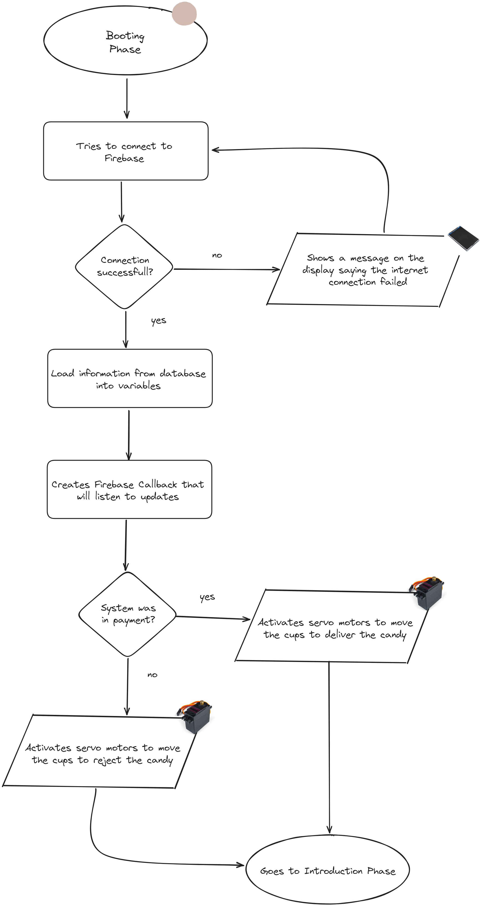
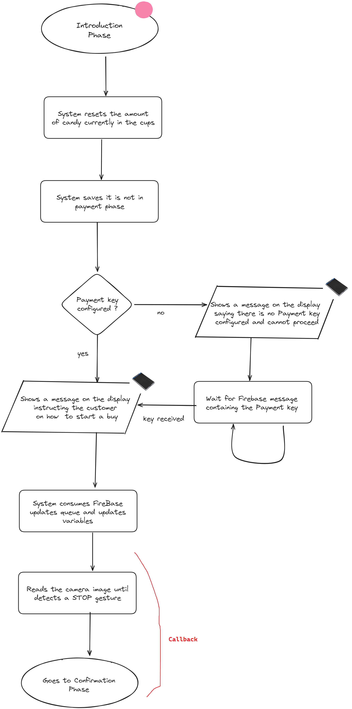
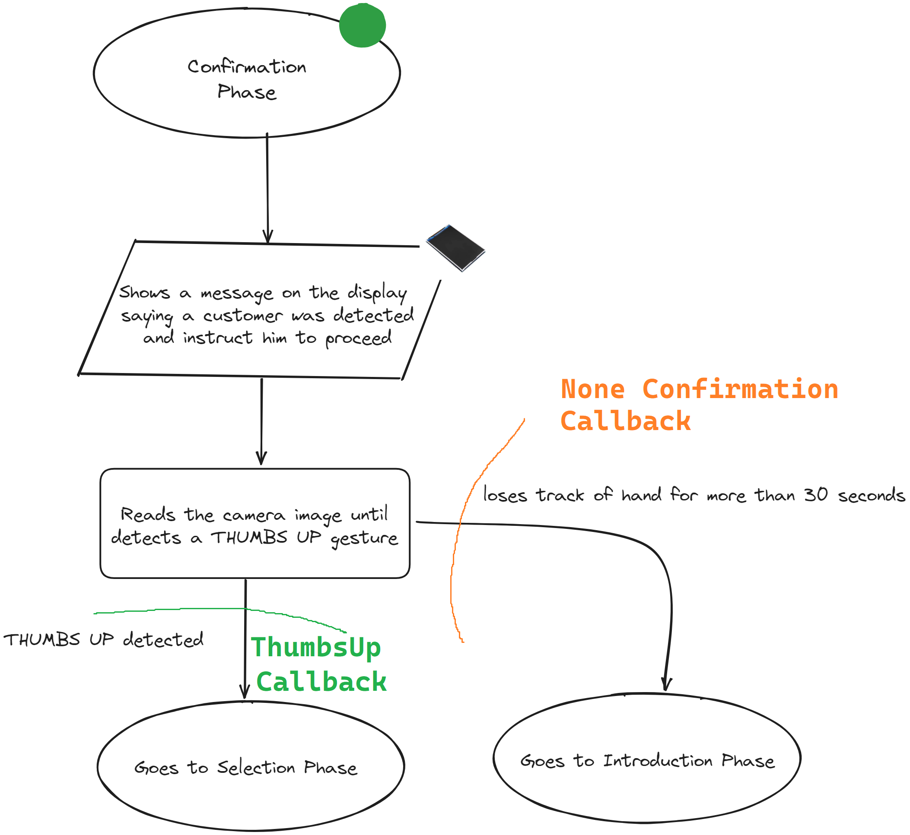
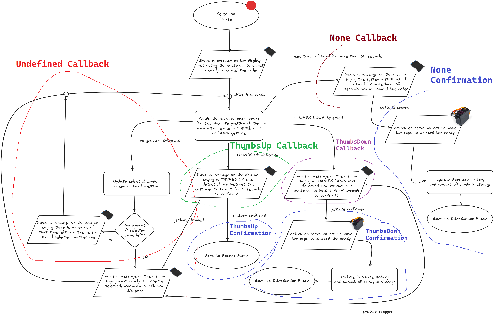
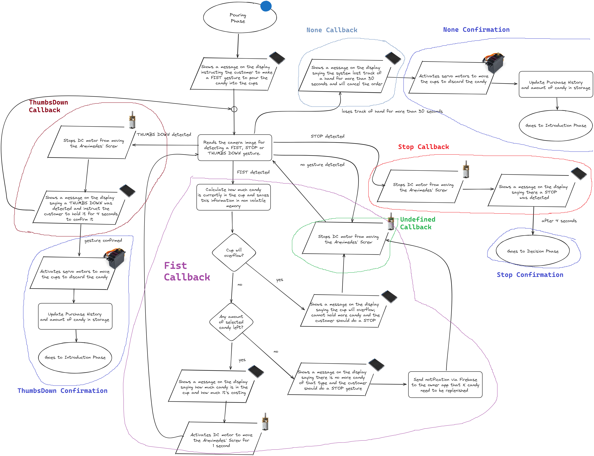
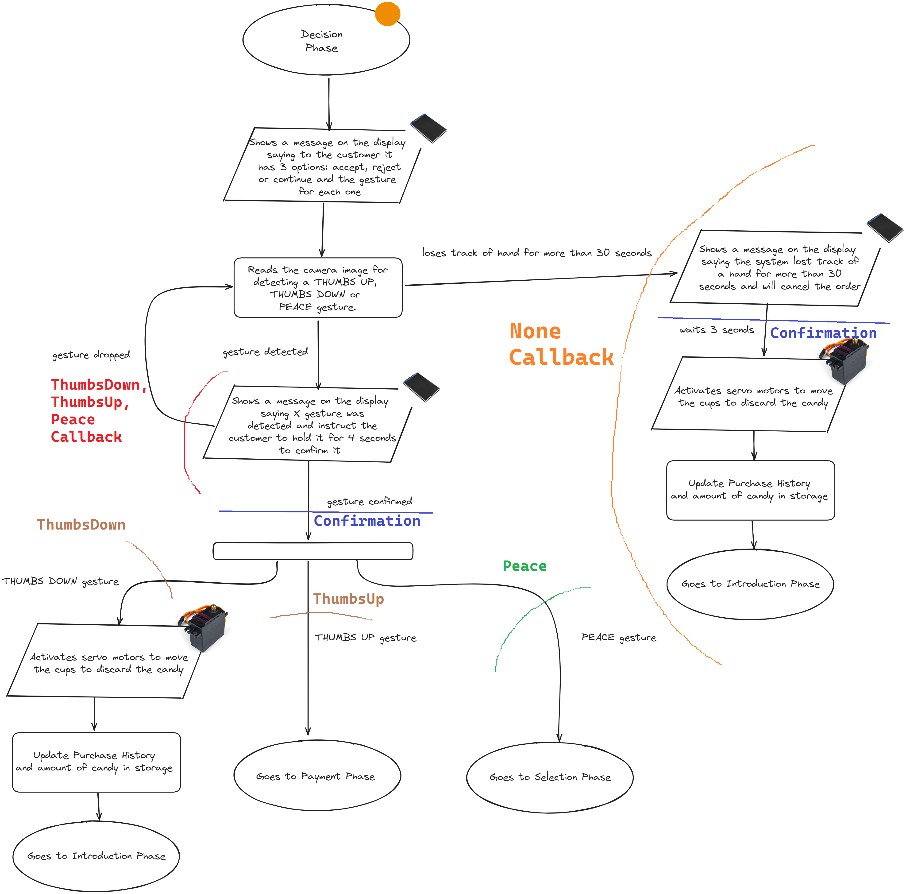
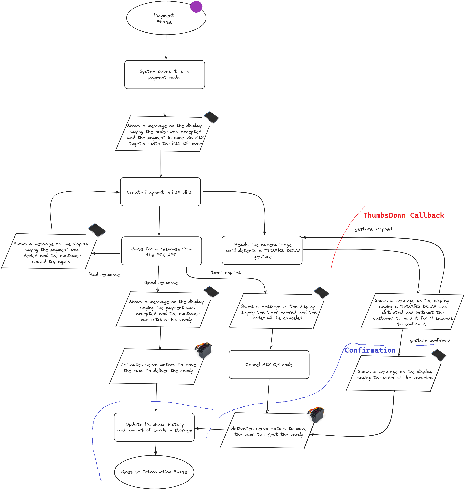

# MageHand

## Helpfull Callback Information

### Booting Phase

### Introduction Phase

- *Summary:*

1 callback: ["Stop"]

### Confirmation Phase

- *Summary:*

2 callbacks: ["None", "ThumbsUp"]

1 confirmation callback: ["None"]

### Selection Phase

- *Summary:*

4 callbacks: ["Undefined", "None", "ThumbsUp", "ThumbsDown"]

3 confirmation callbacks: ["ThumbsUp", "ThumbsDown", "None"]

### Pouring Phase

- *Summary:*

5 callbacks: ["ThumbsDown", "Fist", "Undefined", "Stop", "None"]

3 confirmation callbacks: ["ThumbsDown", "Stop", "None"]

### Decision Phase

- *Summary:*

4 callbacks: ["ThumbsDown", "ThumbsUp", "Peace", "None"] *!!! ThumbsDown, ThumbsUp e Peace são a mesma função*

4 confirmation callbacks: ["ThumbsDown", "ThumbsUp", "Peace", "None"]
### Payment Phase

- *Summary:*

1 callback: ["ThumbsDown"]

1 confirmation callback: ["ThumbsDown"]
